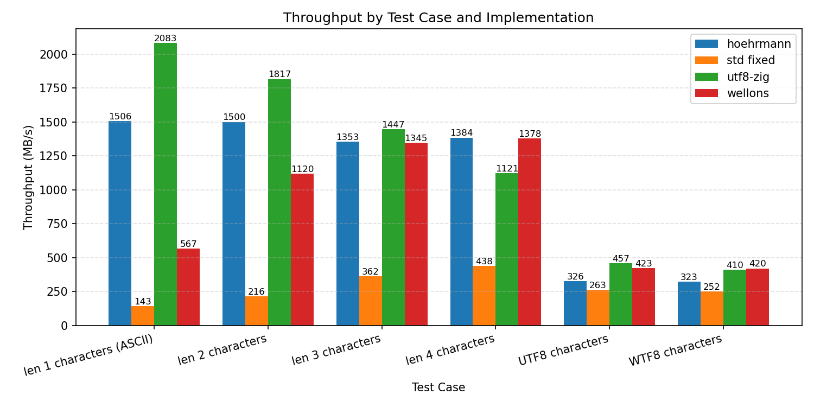
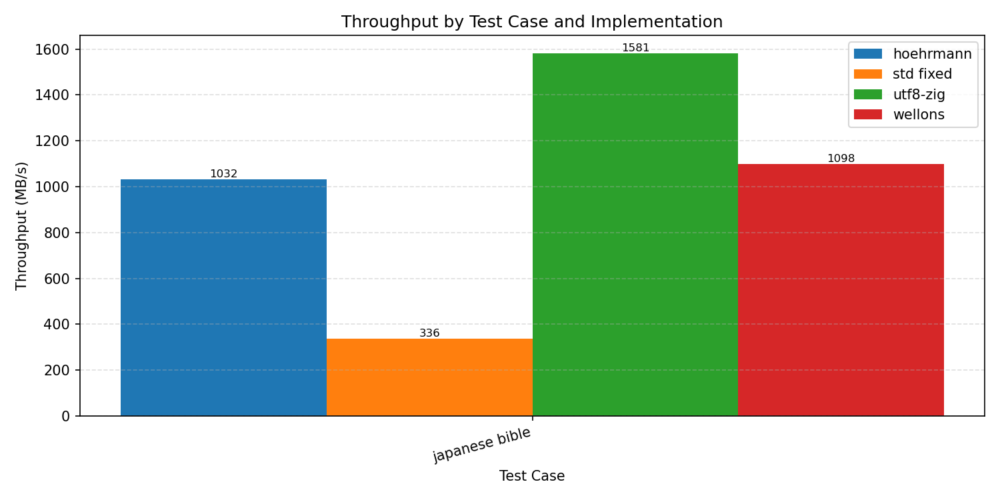
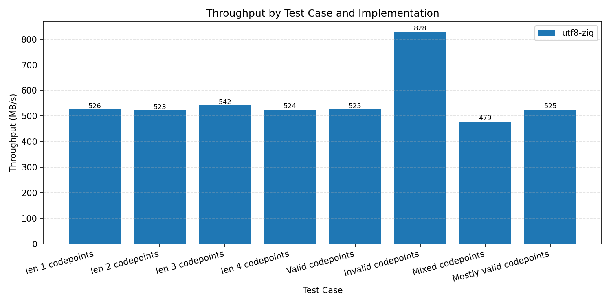

> **Note:** I'm planning to change a lot of this implementation when the std
> reader writer changes happen. Do not depend on this package.

# UTF8-zig

A small and relatively fast UTF8 encoder and decoder library.

## Why

The current implementation in `std` is flawed. The `Utf8Iterator` simply
crashes on invalid inputs, and even then it's quite slow.

## Design goals

This implementation aims to be, in order:

1. Resilient
   - After any sequence of bytes we must return to a valid state
   - No sequence of bytes may crash the program
1. Correct
   - According to [whatwg](https://encoding.spec.whatwg.org/#utf-8)
1. Fast

## Benchmarks

I'm benchmarking on my AMD Ryzen 7 6800H laptop.

### Decoder

In these benchmarks, `std fixed` refers to a version of the `std`
`Utf8Iterator` which returns its errors instead of doing `catch unreachable`.
For all 3 implementations look at their respective files under `./bench/`.

Also note that between these 4 implementations, error handling behavior is
slightly different. The `utf8-zig` implementation does the most error handling,
so I don't think this ruins the benchmark. I should find better references, but
that's for later.

### Encoder

Currently, I don't have any competition, this is a TODO. Additionally, I don't have
any real world benchmarks, this is also a TODO.

## Examples

See examples folder for usage.
